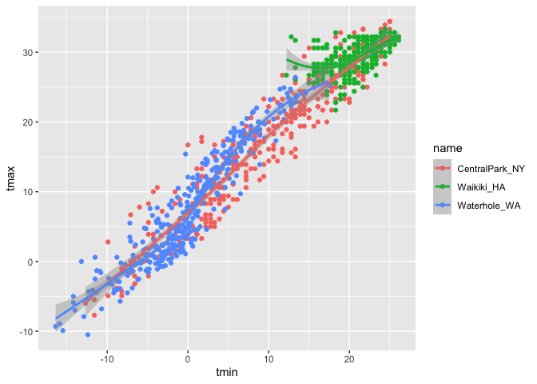
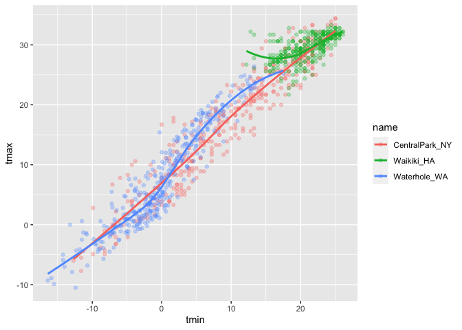
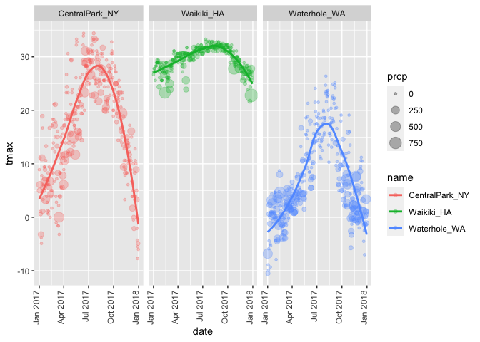
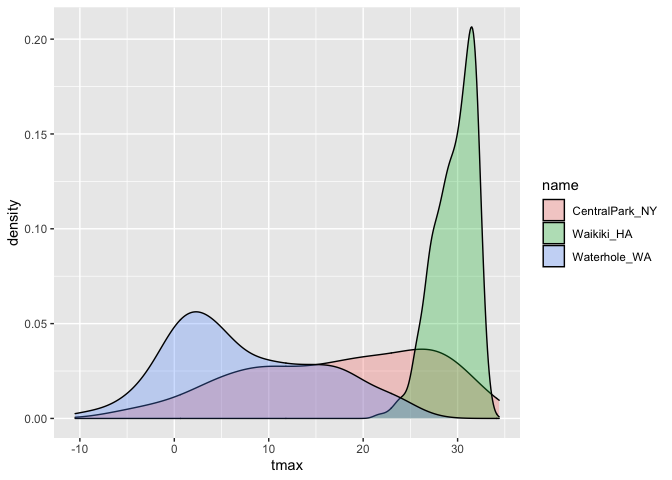
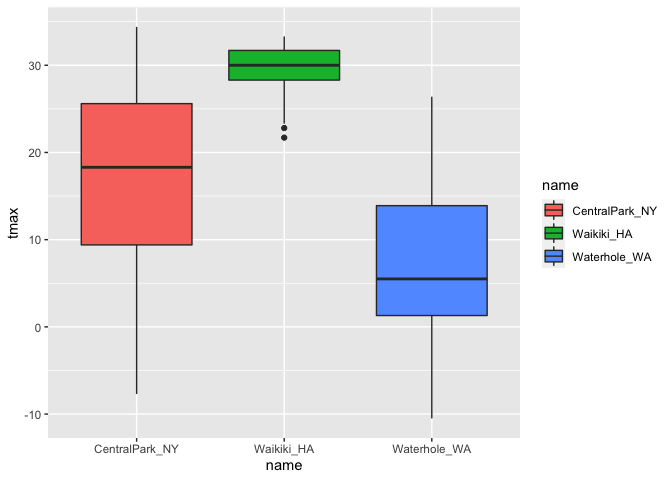
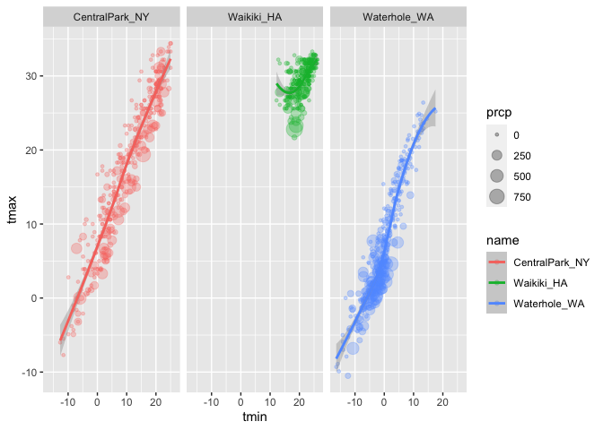
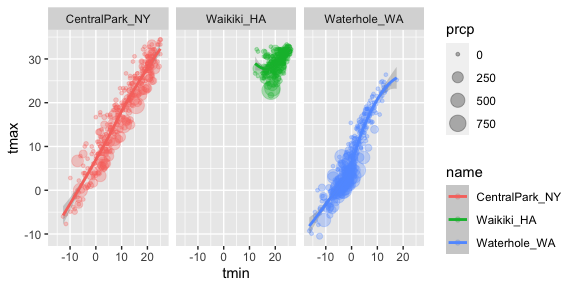
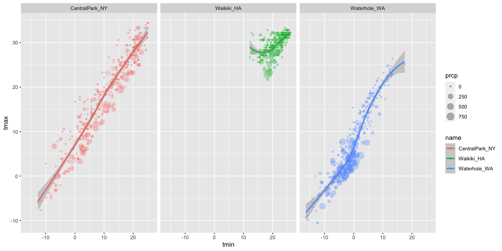

viz_ggplot1
================
2022-09-29

## Let’s import Data

``` r
library(tidyverse)
```

    ## ── Attaching packages ─────────────────────────────────────── tidyverse 1.3.2 ──
    ## ✔ ggplot2 3.3.6      ✔ purrr   0.3.5 
    ## ✔ tibble  3.1.8      ✔ dplyr   1.0.10
    ## ✔ tidyr   1.2.0      ✔ stringr 1.4.1 
    ## ✔ readr   2.1.2      ✔ forcats 0.5.2 
    ## ── Conflicts ────────────────────────────────────────── tidyverse_conflicts() ──
    ## ✖ dplyr::filter() masks stats::filter()
    ## ✖ dplyr::lag()    masks stats::lag()

``` r
library(ggridges)
```

This codes from the course get data

``` r
weather_df = 
  rnoaa::meteo_pull_monitors(
    c("USW00094728", "USC00519397", "USS0023B17S"),
    var = c("PRCP", "TMIN", "TMAX"), 
    date_min = "2017-01-01",
    date_max = "2017-12-31") %>%
  mutate(
    name = recode(
      id, 
      USW00094728 = "CentralPark_NY", 
      USC00519397 = "Waikiki_HA",
      USS0023B17S = "Waterhole_WA"),
    tmin = tmin / 10,
    tmax = tmax / 10) %>%
  select(name, id, everything())
```

    ## Registered S3 method overwritten by 'hoardr':
    ##   method           from
    ##   print.cache_info httr

    ## using cached file: ~/Library/Caches/R/noaa_ghcnd/USW00094728.dly

    ## date created (size, mb): 2022-09-29 10:36:50 (8.401)

    ## file min/max dates: 1869-01-01 / 2022-09-30

    ## using cached file: ~/Library/Caches/R/noaa_ghcnd/USC00519397.dly

    ## date created (size, mb): 2022-09-29 10:36:54 (1.699)

    ## file min/max dates: 1965-01-01 / 2020-03-31

    ## using cached file: ~/Library/Caches/R/noaa_ghcnd/USS0023B17S.dly

    ## date created (size, mb): 2022-09-29 10:36:56 (0.95)

    ## file min/max dates: 1999-09-01 / 2022-09-30

Let’s make a scatterplot

``` r
weather_df %>% 
  drop_na() %>% 
  ggplot(aes(x = tmin, y = tmax)) +
  geom_point()
```

<!-- -->

Let’s keep making the same plot but different

``` r
weather_df %>% 
  drop_na() %>% 
  filter(name == "CentralPark_NY") %>% 
  ggplot(aes(x = tmin, y = tmax))+
  geom_point()
```

<!-- -->

Let’s keep making the same plot but different

``` r
weather_scatterplot = 
  weather_df %>% 
  drop_na() %>% 
  ggplot(aes(x = tmin, y = tmax)) 

weather_scatterplot +
  geom_point()
```

<!-- -->

## Let’s fancy this up a bit

``` r
weather_df %>% 
  ggplot(aes(x = tmin, y = tmax, color = name)) +
  geom_point() +
  geom_smooth()
```

    ## `geom_smooth()` using method = 'loess' and formula 'y ~ x'

    ## Warning: Removed 15 rows containing non-finite values (stat_smooth).

    ## Warning: Removed 15 rows containing missing values (geom_point).

<!-- -->

``` r
weather_df %>% 
  ggplot(aes(x = tmin, y = tmax)) +
  geom_point(aes(color = name)) +
  geom_smooth()
```

    ## `geom_smooth()` using method = 'gam' and formula 'y ~ s(x, bs = "cs")'

    ## Warning: Removed 15 rows containing non-finite values (stat_smooth).

    ## Warning: Removed 15 rows containing missing values (geom_point).

<!-- -->

``` r
weather_df %>% 
  ggplot(aes(x = tmin, y = tmax, color = name)) +
  geom_point(alpha = .3) +
  geom_smooth(se = FALSE)
```

    ## `geom_smooth()` using method = 'loess' and formula 'y ~ x'

    ## Warning: Removed 15 rows containing non-finite values (stat_smooth).

    ## Warning: Removed 15 rows containing missing values (geom_point).

<!-- -->

Make separate panels.

``` r
weather_df %>% 
  ggplot(aes(x = tmin, y = tmax, color = name)) +
  geom_point(alpha = .3) +
  geom_smooth(se = FALSE) +
  facet_grid(. ~ name)
```

    ## `geom_smooth()` using method = 'loess' and formula 'y ~ x'

    ## Warning: Removed 15 rows containing non-finite values (stat_smooth).

    ## Warning: Removed 15 rows containing missing values (geom_point).

<!-- -->

``` r
  ## facet_grid (~ name .)
```

`tmax` and `tmin` are boring, let’s spice it up more!

``` r
weather_df %>% 
  ggplot(aes(x = date, y = tmax, color = name)) +
  geom_point(aes(size = prcp), alpha = .3) +
  geom_smooth(se = FALSE) +
  facet_grid(. ~ name) +
  theme(axis.text.x = element_text(angle = 90, vjust = 0, hjust = 1))
```

    ## `geom_smooth()` using method = 'loess' and formula 'y ~ x'

    ## Warning: Removed 3 rows containing non-finite values (stat_smooth).

    ## Warning: Removed 3 rows containing missing values (geom_point).

<!-- -->

LC: Write a code chain that starts with weather_df; focuses only on
Central Park, converts temperatures to Fahrenheit, makes a scatterplot
of min vs. max temperature, and overlays a linear regression line (using
options in geom_smooth()).

## Some quick stuff

## weather_df %\>%

## mutate (CONVERT TO Fahrenheit)

``` r
weather_df %>% 
  ggplot (aes(x = tmin, y = tmax)) +
  geom_hex()
```

    ## Warning: Removed 15 rows containing non-finite values (stat_binhex).

<!-- -->

## Univariate plots …

Histograms, density, boxplots, violins, …

``` r
weather_df %>% 
  ggplot(aes(x = tmax, fill = name)) +
  geom_histogram() +
  facet_grid(. ~ name)
```

    ## `stat_bin()` using `bins = 30`. Pick better value with `binwidth`.

    ## Warning: Removed 3 rows containing non-finite values (stat_bin).

<!-- -->

Let’s see more options

``` r
weather_df %>% 
  ggplot(aes(x = tmax, fill = name)) +
  geom_density(alpha = .3) 
```

    ## Warning: Removed 3 rows containing non-finite values (stat_density).

<!-- -->

Boxplots??

``` r
weather_df %>% 
  ggplot(aes(x = name, y = tmax, fill = name)) +
  geom_boxplot()
```

    ## Warning: Removed 3 rows containing non-finite values (stat_boxplot).

<!-- -->

``` r
weather_df %>% 
  ggplot(aes(x = name, y = tmax, fill = name)) +
  geom_violin()
```

    ## Warning: Removed 3 rows containing non-finite values (stat_ydensity).

<!-- -->

OR

``` r
weather_df %>% 
  ggplot(aes(x = tmax, y = name)) +
  geom_density_ridges()
```

    ## Picking joint bandwidth of 1.84

    ## Warning: Removed 3 rows containing non-finite values (stat_density_ridges).

<!-- -->

## Saving and embedding plots

First, let’s save a plot

``` r
weather_scatterplot =
  weather_df %>% 
  ggplot(aes(x = tmin, y = tmax, color = name)) +
  geom_point(aes(size = prcp), alpha = .3) +
  geom_smooth(sd = FALSE) +
  facet_grid(. ~ name)
```

    ## Warning: Ignoring unknown parameters: sd

``` r
weather_scatterplot
```

    ## `geom_smooth()` using method = 'loess' and formula 'y ~ x'

    ## Warning: Removed 15 rows containing non-finite values (stat_smooth).

    ## Warning: Removed 15 rows containing missing values (geom_point).

<!-- -->

``` r
ggsave("./results/weather_scatterplot.pdf", weather_scatterplot, width = 8, height = 5)
```

    ## `geom_smooth()` using method = 'loess' and formula 'y ~ x'

    ## Warning: Removed 15 rows containing non-finite values (stat_smooth).
    ## Removed 15 rows containing missing values (geom_point).

What about embedding?

``` r
weather_scatterplot
```

    ## `geom_smooth()` using method = 'loess' and formula 'y ~ x'

    ## Warning: Removed 15 rows containing non-finite values (stat_smooth).

    ## Warning: Removed 15 rows containing missing values (geom_point).

<!-- -->

Embed at a different size

``` r
weather_scatterplot
```

    ## `geom_smooth()` using method = 'loess' and formula 'y ~ x'

    ## Warning: Removed 15 rows containing non-finite values (stat_smooth).

    ## Warning: Removed 15 rows containing missing values (geom_point).

<!-- -->
